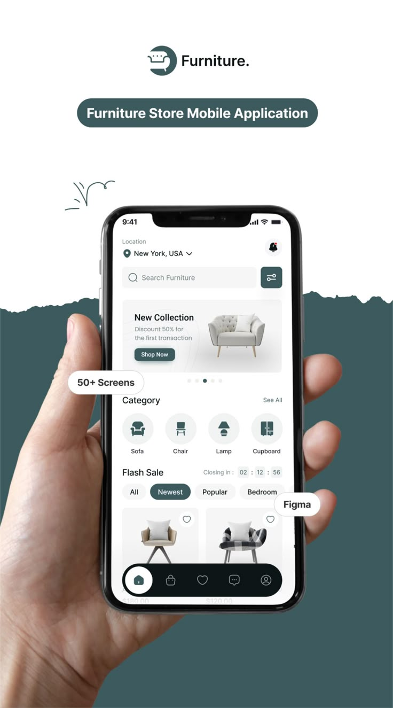
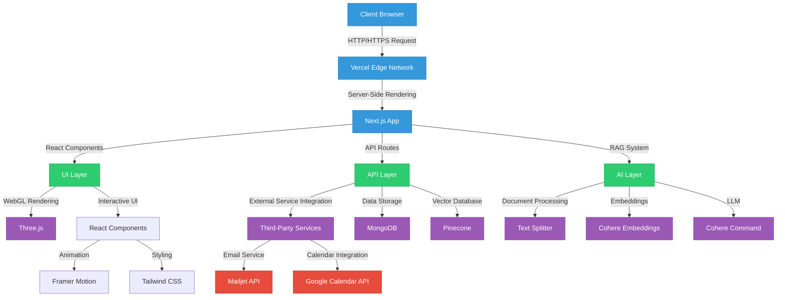
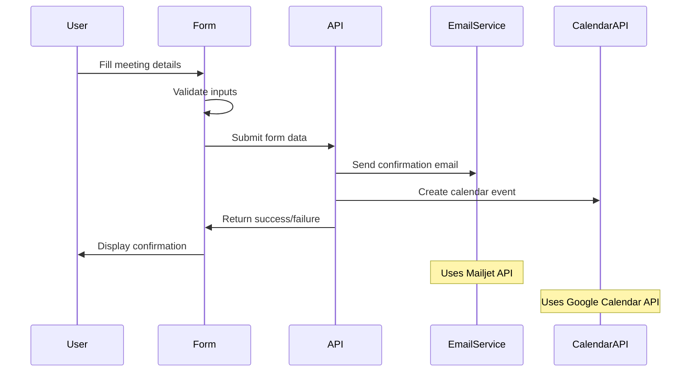

# <div align="center">🚀 WebAgency</div>

<div align="center">
  
</div>

<div align="center">
  <h2>Advanced Web Development & AI-Powered Digital Solutions</h2>
  
  [](https://nextjs.org/)
  [](https://reactjs.org/)
  [](https://www.typescriptlang.org/)
  [](https://tailwindcss.com/)
  [](https://threejs.org/)
  [](https://www.goonline.site)

  <p><strong>Elevating Digital Experiences Through AI Integration & Technical Innovation</strong></p>
  
  [**Live Demo**](https://www.goonline.site) • [**Documentation**](docs/) • [**Contact**](#-contact)
</div>

---

<details open>
<summary><h2>📋 Table of Contents</h2></summary>

- [🏛️ Overview](#%EF%B8%8F-overview)
- [📊 System Architecture](#-system-architecture)
- [🧠 AI Integration](#-ai-integration)
- [🔧 Technical Stack](#-technical-stack)
- [🖼️ UI Components](#%EF%B8%8F-ui-components)
- [📅 Meeting Scheduler](#-meeting-scheduler)
- [🚀 Key Features](#-key-features)
- [💾 Installation](#-installation)
- [🔍 Usage](#-usage)
- [🛡️ Security](#%EF%B8%8F-security)
- [📚 Resources](#-resources)
- [📩 Contact](#-contact)

</details>

---

## 🏛️ Overview

WebAgency is a comprehensive platform that combines advanced web development techniques with cutting-edge AI technology to deliver exceptional digital experiences. The platform showcases:

<table>
  <tr>
    <td width="33%" align="center">
      
      <br/>
      <strong>Modern Web Development</strong>
    </td>
    <td width="33%" align="center">
      
      <br/>
      <strong>Digital Marketing Solutions</strong>
    </td>
    <td width="33%" align="center">
      
      <br/>
      <strong>Responsive UI/UX Design</strong>
    </td>
  </tr>
</table>

> "WebAgency represents the convergence of technical excellence and creative innovation, delivering digital solutions that drive business success."

---

## 📊 System Architecture

The platform uses a modern, scalable architecture optimized for performance and maintainability:

<div align="center">



</div>

### Multi-Tier Architecture Design

The application follows a robust multi-tier architecture:

<div style="background-color: #f8f9fa; padding: 20px; border-radius: 8px;">
  <pre>
  ┌─────────────────────────────────────────────────────────────┐
  │                    Client Application                        │
  ├─────────────┬─────────────────────────┬────────────────────┤
  │ UI Layer    │ Business Logic Layer    │ Data Access Layer  │
  │             │                         │                    │
  │ ◆ Components│ ◆ Service Wrappers      │ ◆ API Clients      │
  │ ◆ Layouts   │ ◆ State Management      │ ◆ Data Fetching    │
  │ ◆ Pages     │ ◆ Event Handling        │ ◆ Persistence      │
  └─────────────┴─────────────────────────┴────────────────────┘
               │                   │                  │
               ▼                   ▼                  ▼
  ┌───────────────┐   ┌─────────────────┐   ┌────────────────┐
  │ API Routes    │   │ External APIs    │   │ Databases      │
  └───────────────┘   └─────────────────┘   └────────────────┘
  </pre>
</div>

---

## 🧠 AI Integration

<div class="grid" style="display: grid; grid-template-columns: 1fr 1fr; gap: 20px;">
  <div>
    <h3>RAG-Based Chatbot System</h3>
    <p>The platform leverages Retrieval-Augmented Generation (RAG) to provide contextually relevant responses to user queries by combining document retrieval with AI-generated answers.</p>
    <ul>
      <li>📄 <strong>Document Processing</strong>: Texts are split into manageable chunks</li>
      <li>🔍 <strong>Vector Embedding</strong>: Cohere API converts text to numerical vectors</li>
      <li>💾 <strong>Vector Storage</strong>: Pinecone stores and retrieves similar documents</li>
      <li>🧠 <strong>LLM Generation</strong>: Cohere Command model generates responses</li>
    </ul>
  </div>
  <div>
    <div align="center">
      <pre>
  ┌──────────────────┐      ┌─────────────────┐      ┌───────────────┐
  │                  │      │                 │      │               │
  │ Text Documents   │─────▶│   Text Splitter │─────▶│  Cohere       │
  │                  │      │                 │      │  Embeddings   │
  └──────────────────┘      └─────────────────┘      └───────┬───────┘
                                                             │
                                                             ▼
  ┌──────────────────┐      ┌─────────────────┐      ┌───────────────┐
  │                  │      │                 │      │               │
  │  User Query      │─────▶│  Query Vector   │─────▶│   Pinecone    │
  │                  │      │                 │      │   Vector DB   │
  └──────────────────┘      └─────────────────┘      └───────┬───────┘
                                                             │
                                                             ▼
  ┌──────────────────┐      ┌─────────────────┐      ┌───────────────┐
  │                  │      │                 │      │               │
  │  Response        │◀─────│  Cohere LLM     │◀─────│  Retrieved    │
  │  Generation      │      │  (Command)      │      │  Context      │
  └──────────────────┘      └─────────────────┘      └───────────────┘
      </pre>
    </div>
  </div>
</div>

<details>
<summary><strong>View RAG Implementation Code</strong></summary>

```typescript
// Key components of the RAG system
class CohereEmbeddings {
  private client: CohereClient;

  constructor(apiKey: string) {
    this.client = new CohereClient({ token: apiKey });
  }

  // Convert text to vector embeddings for document storage
  async embedDocuments(texts: string[]): Promise<number[][]> {
    const response = await this.client.embed({
      texts,
      model: "embed-english-v3.0",
      inputType: "search_document",
    });
    return response.embeddings as number[][];
  }
  
  // Convert query to vector embedding for search
  async embedQuery(text: string): Promise<number[]> {
    const response = await this.client.embed({
      texts: [text],
      model: "embed-english-v3.0",
      inputType: "search_query",
    });
    return (response.embeddings as number[][])[0];
  }
}

// Search and retrieve relevant context
async search(query: string, k: number = 3) {
  if (!vectorStore) return [];
  return await vectorStore.similaritySearch(query, k);
}

// Generate AI response with context
async generateAnswer(query: string) {
  // Retrieve relevant documents
  const docs = await vectorStore.similaritySearch(query, 5);
  
  // Extract and format context
  const context = docs.map(doc => doc.pageContent).join('\n\n');
  
  // Generate response using Cohere LLM with context
  const response = await cohereClient.chat({
    message: query,
    model: 'command',
    temperature: 0.3,
    preamble: `You are a helpful assistant for a web development agency...`,
    documents: [{ text: context }]
  });
  
  return response.text;
}
```
</details>

---

## 🔧 Technical Stack

<div style="background-color: #f0f5f9; padding: 15px; border-radius: 8px; border-left: 5px solid #38b2ac;">

### Core Technologies

<table>
  <thead>
    <tr>
      <th>Category</th>
      <th>Technology</th>
      <th>Implementation</th>
      <th>Purpose</th>
    </tr>
  </thead>
  <tbody>
    <tr>
      <td><strong>Frontend Framework</strong></td>
      <td>Next.js 14</td>
      <td>App Router, Server Components</td>
      <td>Server-side rendering, routing, API endpoints</td>
    </tr>
    <tr>
      <td><strong>UI Library</strong></td>
      <td>React 18</td>
      <td>Client Components, Hooks</td>
      <td>Component-based architecture, state management</td>
    </tr>
    <tr>
      <td><strong>Styling</strong></td>
      <td>Tailwind CSS</td>
      <td>Utility-first CSS, Dark Mode</td>
      <td>Responsive design, theming, consistent UI</td>
    </tr>
    <tr>
      <td><strong>3D Graphics</strong></td>
      <td>Three.js</td>
      <td>WebGL, DisplacementSphere</td>
      <td>Interactive 3D visualizations, immersive UI</td>
    </tr>
    <tr>
      <td><strong>Animation</strong></td>
      <td>Framer Motion</td>
      <td>Page Transitions, Micro-interactions</td>
      <td>Smooth animations, enhanced UX</td>
    </tr>
    <tr>
      <td><strong>Form Handling</strong></td>
      <td>React Hook Form</td>
      <td>Validation, Submission</td>
      <td>Efficient form state management, validation</td>
    </tr>
    <tr>
      <td><strong>Type Safety</strong></td>
      <td>TypeScript</td>
      <td>Static Typing, Interfaces</td>
      <td>Type checking, improved DX, error prevention</td>
    </tr>
    <tr>
      <td><strong>AI/ML</strong></td>
      <td>LangChain, Cohere</td>
      <td>RAG Pattern, Embeddings</td>
      <td>AI-powered chat, semantic search, content generation</td>
    </tr>
    <tr>
      <td><strong>Vector DB</strong></td>
      <td>Pinecone</td>
      <td>Semantic Search</td>
      <td>Vector storage, similarity search</td>
    </tr>
    <tr>
      <td><strong>API Integration</strong></td>
      <td>Google Calendar, Mailjet</td>
      <td>Meeting Scheduling</td>
      <td>Calendar events, email notifications</td>
    </tr>
    <tr>
      <td><strong>Deployment</strong></td>
      <td>Vercel</td>
      <td>Edge Network, Analytics</td>
      <td>Global CDN, performance monitoring</td>
    </tr>
  </tbody>
</table>
</div>

---

## 🖼️ UI Components

The platform features advanced UI components combining WebGL, animations, and interactive elements:

### Component Architecture

<div style="background-color: #f8f9fa; padding: 15px; border-radius: 8px; border-left: 5px solid #6c5ce7;">

```
components/
├── ui/                       # Atomic UI components
│   ├── DisplacementSphere/   # WebGL background effect
│   ├── hero-parallax.tsx     # Parallax scrolling hero
│   ├── focus-cards.tsx       # Interactive card components
│   ├── cover.tsx             # Hero section component
│   ├── sparkles.tsx          # Sparkle animation effect
│   └── world-map.tsx         # Interactive world map
├── Chatbot/                  # AI chatbot components
│   ├── chat.tsx              # Main chat interface
│   ├── message.tsx           # Message rendering
│   ├── textarea.tsx          # Input component
│   └── markdown.tsx          # Markdown rendering
├── wrapper/                  # Layout components
│   ├── GridBackgroudLayout/  # Background grid system
│   ├── WebGLWrapper/         # WebGL context provider
│   └── ErrorBoundary/        # Error handling
└── hoc/                      # Higher-order components
    └── withThemeRerender/    # Theme-aware components
```
</div>

### WebGL Rendering System

The `DisplacementSphere` component creates an immersive 3D background experience using Three.js:

<details>
<summary><strong>View DisplacementSphere Implementation</strong></summary>

```typescript
// Three.js-powered dynamic sphere
const DisplacementSphere: React.FC<DisplacementSphereProps> = ({ 
  themeAware = false, 
  position = [0, 0, 0] 
}) => {
  const containerRef = useRef<HTMLDivElement>(null);
  const { theme } = useTheme();
  const isDarkTheme = theme === 'dark';
  
  useEffect(() => {
    if (!containerRef.current) return;
    
    // Initialize Three.js scene
    const scene = new THREE.Scene();
    const camera = new THREE.PerspectiveCamera(54, window.innerWidth / window.innerHeight, 0.1, 100);
    camera.position.z = 3;
    
    // Create WebGL renderer
    const renderer = new THREE.WebGLRenderer({ 
      alpha: true,
      antialias: true,
      powerPreference: 'high-performance'
    });
    renderer.setSize(window.innerWidth, window.innerHeight);
    renderer.setPixelRatio(Math.min(window.devicePixelRatio, 2));
    containerRef.current.appendChild(renderer.domElement);
    
    // Sphere geometry with noise displacement
    const geometry = new THREE.SphereGeometry(1, 128, 128);
    const material = new THREE.ShaderMaterial({
      uniforms: { 
        time: { value: 0 },
        theme: { value: isDarkTheme ? 1.0 : 0.0 }
      },
      vertexShader: `
        uniform float time;
        varying vec2 vUv;
        varying float noise;
        
        // Simplex noise implementation
        vec3 mod289(vec3 x) { return x - floor(x * (1.0 / 289.0)) * 289.0; }
        vec4 mod289(vec4 x) { return x - floor(x * (1.0 / 289.0)) * 289.0; }
        vec4 permute(vec4 x) { return mod289(((x*34.0)+1.0)*x); }
        vec4 taylorInvSqrt(vec4 r) { return 1.79284291400159 - 0.85373472095314 * r; }
        float snoise(vec3 v) { /* ... noise implementation ... */ }
        
        void main() {
          vUv = uv;
          float displacement = snoise(position * 0.3 + time * 0.1) * 0.3;
          vec3 newPosition = position + normal * displacement;
          gl_Position = projectionMatrix * modelViewMatrix * vec4(newPosition, 1.0);
        }
      `,
      fragmentShader: `
        uniform float time;
        uniform float theme;
        varying vec2 vUv;
        
        void main() {
          // Dynamic color based on theme and position
          vec3 color1 = theme > 0.5 
            ? vec3(0.1, 0.1, 0.2) 
            : vec3(0.8, 0.8, 0.9);
          vec3 color2 = theme > 0.5 
            ? vec3(0.3, 0.2, 0.4) 
            : vec3(0.4, 0.5, 0.9);
          vec3 finalColor = mix(color1, color2, vUv.y);
          gl_FragColor = vec4(finalColor, 0.7);
        }
      `
    });
    
    const sphere = new THREE.Mesh(geometry, material);
    sphere.position.set(...position);
    scene.add(sphere);
    
    // Handle window resize
    const handleResize = () => {
      camera.aspect = window.innerWidth / window.innerHeight;
      camera.updateProjectionMatrix();
      renderer.setSize(window.innerWidth, window.innerHeight);
    };
    window.addEventListener('resize', handleResize);
    
    // Animation loop for dynamic effects
    const animate = (time: number) => {
      material.uniforms.time.value = time * 0.001;
      sphere.rotation.y = time * 0.0002;
      renderer.render(scene, camera);
      requestAnimationFrame(animate);
    };
    
    animate(0);
    
    // Cleanup function
    return () => {
      if (containerRef.current) {
        containerRef.current.removeChild(renderer.domElement);
      }
      window.removeEventListener('resize', handleResize);
      geometry.dispose();
      material.dispose();
      renderer.dispose();
    };
  }, [isDarkTheme, position, themeAware]);
  
  return <div ref={containerRef} className="absolute inset-0 -z-10" />;
};

export default DisplacementSphere;
```
</details>

### Reactive Animations

The platform uses Framer Motion for smooth, physics-based animations:

```tsx
// Page transition example
<motion.div 
  initial={{ opacity: 0, y: 20 }}
  animate={{ opacity: 1, y: 0 }}
  exit={{ opacity: 0, y: -20 }}
  transition={{ 
    type: "spring", 
    stiffness: 260, 
    damping: 20,
    duration: 0.5 
  }}
>
  {children}
</motion.div>
```

---

## 📅 Meeting Scheduler

The platform includes a sophisticated meeting scheduling system with email notifications and calendar integration:

<div align="center">



</div>

### Key Features

- **Intuitive Form Interface**: User-friendly design with reactive validation
- **Flexible Meeting Types**:
  - Discovery Call (30 min)
  - Project Consultation (45 min)
  - Website Audit (60 min)
  - Custom Request (variable duration)
- **Smart Time Slot Management**: Configurable availability with timezone detection
- **Automated Communications**: Email confirmations to both client and team
- **Calendar Integration**: Automatic event creation with Google Calendar
- **Conflict Detection**: Prevents double-booking through calendar verification

---

## 🚀 Key Features

<div style="display: grid; grid-template-columns: repeat(auto-fit, minmax(300px, 1fr)); gap: 20px;">

<div style="background-color: rgba(52, 152, 219, 0.1); padding: 20px; border-radius: 8px; border-left: 4px solid #3498db;">
  <h3>🎨 Advanced UI</h3>
  <ul>
    <li>WebGL-powered 3D backgrounds</li>
    <li>Parallax scrolling effects</li>
    <li>Fluid animations & transitions</li>
    <li>Responsive, mobile-first design</li>
    <li>Dark/Light theme with system detection</li>
  </ul>
</div>

<div style="background-color: rgba(46, 204, 113, 0.1); padding: 20px; border-radius: 8px; border-left: 4px solid #2ecc71;">
  <h3>🧠 AI Integration</h3>
  <ul>
    <li>Contextual RAG-based chatbot</li>
    <li>Semantic search functionality</li>
    <li>Vector-based document retrieval</li>
    <li>Natural language understanding</li>
    <li>Personalized responses</li>
  </ul>
</div>

<div style="background-color: rgba(155, 89, 182, 0.1); padding: 20px; border-radius: 8px; border-left: 4px solid #9b59b6;">
  <h3>🔄 Business Tools</h3>
  <ul>
    <li>Smart meeting scheduler</li>
    <li>Calendar integration</li>
    <li>Automated email notifications</li>
    <li>Client request management</li>
    <li>Project tracking capabilities</li>
  </ul>
</div>

<div style="background-color: rgba(231, 76, 60, 0.1); padding: 20px; border-radius: 8px; border-left: 4px solid #e74c3c;">
  <h3>⚡ Performance</h3>
  <ul>
    <li>Server-side rendering</li>
    <li>Edge function computation</li>
    <li>Image optimization</li>
    <li>Code splitting & lazy loading</li>
    <li>Efficient state management</li>
  </ul>
</div>

</div>

---

## 💾 Installation

<div style="background-color: #282c34; color: #abb2bf; padding: 20px; border-radius: 8px; font-family: monospace; white-space: pre;">
<code>
# Clone the repository
git clone https://github.com/iamyashsiwach/webagency.git

# Navigate to the project
cd webagency

# Install dependencies
npm install

# Set up environment variables
cp .env.example .env.local
# Edit .env.local with your API keys

# Start development server
npm run dev
</code>
</div>

### Environment Configuration

Create a `.env.local` file with the following variables:

```bash
# API Keys
MAILJET_API_KEY=your_key_here
MAILJET_SECRET_KEY=your_secret_here

# AI Providers
COHERE_API_KEY=your_cohere_key

# Vector Database
PINECONE_API_KEY=your_pinecone_key
PINECONE_ENVIRONMENT=your_environment
PINECONE_INDEX=agency

# Email Configuration
EMAIL_FROM=your_email@example.com
TEAM_EMAIL=team@example.com

# Google Calendar (optional)
GOOGLE_CLIENT_ID=your_client_id
GOOGLE_CLIENT_SECRET=your_client_secret
GOOGLE_REFRESH_TOKEN=your_refresh_token
```

### Development Tools

- **Component Development**: `npm run storybook`
- **Linting**: `npm run lint`
- **Code Formatting**: `npm run format`
- **Testing**: `npm run test`
- **Build for Production**: `npm run build`

---

## 🔍 Usage

Access the application functionality through:

1. **Main Website**: Frontend marketing site with interactive UI
2. **AI Chatbot**: Located at `/chatbot` for intelligent assistance
3. **Meeting Scheduler**: Available at `/Schedule` for booking appointments
4. **API Endpoints**: RESTful services at `/api/*` for integration

---

## 🛡️ Security

<div style="background-color: rgba(241, 196, 15, 0.1); padding: 20px; border-radius: 8px; border-left: 4px solid #f1c40f;">

### Security Measures Implemented

- **API Key Protection**: Server-side environment variables
- **Input Validation**: Form validation with React Hook Form
- **XSS Prevention**: React's built-in escaping, content sanitization
- **Authentication**: Protected routes and API endpoints
- **CORS Configuration**: API route protection
- **Rate Limiting**: API endpoint protection
- **Dependency Scanning**: Regular vulnerability checks
- **Content Security Policy**: Strict CSP implementation
- **Environment Variable Isolation**: Server-side access only

</div>

---

## �� Resources

- [Next.js Documentation](https://nextjs.org/docs)
- [Three.js Documentation](https://threejs.org/docs/)
- [Framer Motion API](https://www.framer.com/motion/)
- [LangChain Documentation](https://js.langchain.com/docs/)
- [Cohere API Documentation](https://docs.cohere.com/)
- [Pinecone Documentation](https://docs.pinecone.io/)

---

## 📩 Contact

<div align="center">
  <a href="mailto:iamyashsiwach@gmail.com">
    
  </a>
  <a href="https://yashsiwach.space">
    
  </a>
  <a href="https://github.com/iamyashsiwach">
    
  </a>
</div>

---

<div align="center">
  <p>
    <a href="LICENSE"></a>
  </p>
  <sub>Built with ❤️ by Yash Siwach</sub>
  <br/>
  <a href="https://www.goonline.site">www.goonline.site</a>
</div>
